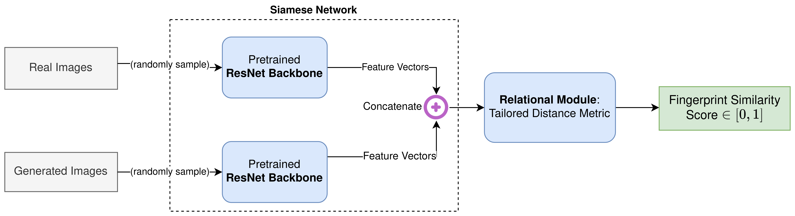

# ImageCLEF Medical GANs 2023

Scripts, figures, and working notes for our team's participation in [ImageCLEFmedical GAN task 2023](https://www.imageclef.org/2023/medical/gans), part of the [ImageCLEF labs](https://www.imageclef.org/2023) at the [14th CLEF Conference, 2023](https://clef2023.clef-initiative.eu/index.php).

**Implementation Stack**: Python, PyTorch, Scikit-learn.

## Quick Links

- [Research Paper [PDF]](https://ceur-ws.org/Vol-3497/paper-116.pdf) describing the methods, rationale, and results.
- [Contest Description and Resources](https://www.imageclef.org/2023/medical/gans).
- [Model Pipelines](./src/).


## Cite Us

[Link to the Research Paper](https://ceur-ws.org/Vol-3497/paper-116.pdf).

If you find our work useful in your research, don't forget to cite us!

```
@article{hb2023correlating,
  url = {https://ceur-ws.org/Vol-3497/paper-116.pdf},
  title={Correlating Biomedical Image Fingerprints between GAN-generated and Real Images using a ResNet Backbone with ML-based Downstream Comparators and Clustering: ImageCLEFmed GANs, 2023},
  author={Bharathi, Haricharan and Bhaskar, Anirudh and Venkataramani, Vishal and Desingu, Karthik and Kalinathan, Lekshmi},
  year={2023},
  keywords={Generative Adversarial Network, Support Vector Machines, Heirarchical Clustering, Machine Learning, Deep Learning, ResNet, Convolutional Neural Networks, Few shot learning, Relational model
},
  journal={Conference and Labs of the Evaluation Forum},
  publisher={Conference and Labs of the Evaluation Forum},
  ISSN={1613-0073},  
  copyright = {Creative Commons Attribution 4.0 International}
}
```

## Key Highlights

   

- A relation neural network based on few-shot learning to capture the underlying similarities between real and artificial images.
- The network learns a tailored difference function to effectively compare images for artificialness arising from GAN-based generation.
- For comparison, hierarchical clustering is used to evaluate the quality of image feature separation between real and artificial images.
- The proposed relational network achieves a **61.4% F1-score** in distinguishing real and artificial medical images on a blinded test-set provided and evaluated by ImageCLEF.

See [research note](https://ceur-ws.org/Vol-3497/paper-116.pdf) and [contest page](https://www.imageclef.org/2023/medical/gans) for more information.

